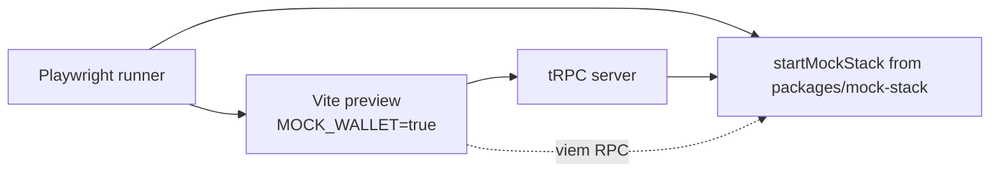

# Playwright E2E for the Subsquid Network app

> **Status:** plan, not yet executed.
> **Prerequisite:** the mock-stack package from [plans/wagmi-viem-testing.md](wagmi-viem-testing.md) must be in place. This plan reuses that package's deploy harness, mini-indexer, and `.anvil-state.json` snapshot.
> **Scope:** Playwright E2E covering post-connect app flows.
> **Out of scope:** Vitest unit/integration (covered by the mock-environment plan), real wallet UX (Synpress — backlogged in §6).

## 1. Goals

- Catch regressions in user-visible flows that span multiple pages, real router transitions, real tRPC calls, real on-chain writes, and real indexer-derived reads.
- Run against the **same** mock stack used by component tests — one source of truth for fixtures.
- No MetaMask, no extension. Wallet UX is **explicitly out of scope** of this layer; the wagmi `mock` connector is sufficient.

## 2. Critical flows (initial set)

Each spec asserts UI state before, mid, and after the on-chain write, plus the mini-indexer-served list/detail data:

- **delegate** — connect persona, navigate to a worker page, delegate SQD, see allowance approve, see balance + delegation list reflect after one block.
- **undelegate** — start from the delegated state, request undelegation, observe pending withdrawal, advance epoch, claim.
- **claim rewards** — persona with claimable rewards, claim from `Assets`, balance updates.
- **register worker** — operator persona, register a new worker, see it appear in `myWorkers`.
- **assets summary** — load the `Assets` page for a portfolio persona; verify pie chart + breakdown match the seeded chain state and synthetic aggregates.

## 3. Architecture

Stack details — Anvil bootstrap, deploy harness, mini-indexer, snapshot/replay — are owned by [wagmi-viem-testing.md §4–6](wagmi-viem-testing.md). This plan only adds Playwright wiring on top.



- Playwright `globalSetup` calls `startMockStack()` from `packages/mock-stack` (the single public entrypoint defined in mock-env §4.0). Same handle, same lifecycle as Vitest.
- **Vite preview** (`pnpm --filter @subsquid/client preview`) serves the `MOCK_WALLET=true` bundle.
- Per-test reset: `testClient.revert(snap)` + clear `localStorage`/`sessionStorage` in the page + `indexer.resetAndReplay()` + new snapshot. (Same recipe as mock-env §6.)

## 4. Persona handling

- **Primary mechanism:** a Playwright-only `window.__mockAccount` global, read at boot by `MockWalletAutoConnect` to drive the initial connect. Tests set it via `page.addInitScript(() => { window.__mockAccount = N })` before navigation. This is the **default** path — independent of any wagmi-side refactor.
- **Required client edit (delivered by this plan, not the mock-env plan):** add a `__mockAccount` read to [MockWalletAutoConnect.tsx](../packages/client/src/components/MockWalletAutoConnect.tsx), gated on `import.meta.env.MODE === 'production'` being false **or** an explicit `E2E` build flag, so prod bundles never expose it.
- **Optional bonus:** if mock-env's `useSwitchAccount` investigation succeeds, mid-test persona switches can use `switchAccount` via the wagmi store. Not required for any spec in §2.
- Persona fixtures match the four `MOCK_FIXTURE_ACCOUNTS` from [packages/client/src/config.ts](../packages/client/src/config.ts) (Alice/Bob/Carol/Dave).

## 5. Worker / port strategy

- `playwright.config.ts` defaults to `workers: 1` for the first iteration — guarantees no Anvil port collisions and no indexer-state cross-talk. Cost is acceptable since the suite is small (5 specs).
- Per-spec setup time: `--load-state` + indexer warm-up ≈ 1–2s, snapshot reset ≈ <100ms.
- Future scale-out: per-worker Anvil on `8545 + workerId` and per-worker indexer port; only worth doing when wall time justifies it.

## 6. Wallet UX backlog (Synpress)

Not in this plan. When the team decides to validate the production wallet UX:

- Add a parallel `e2e-wallet/` Playwright project using `@synthetixio/synpress` v4 with MetaMask.
- Cover: RainbowKit modal open/close, account import, sign rejection, chain switch prompt, lock/unlock.
- Backed by Anvil from the mock stack — same chain, real wallet UI.

## 7. CI integration

- Add `test:e2e` task to root `turbo.json` with `dependsOn: ['mock-stack#prepare', 'client#build']`. Build inputs include the `MOCK_WALLET` env var (and any other defines from `vite.config.ts`) so the cache key changes when those flip.
- **No cross-workflow artifact handoff.** `mock-stack#prepare` runs in this workflow whenever its inputs change; turbo cache (and optionally remote cache) deduplicates if the unit-test workflow ran the same task earlier on the same SHA. Avoiding `workflow_run`/artifact upload keeps the E2E workflow self-contained and re-runnable in isolation.
- `.github/workflows/test-e2e.yaml`:
  - `actions/checkout@v4` with `submodules: recursive`.
  - `foundry-rs/foundry-toolchain@v1`.
  - `actions/cache` for `packages/mock-stack/.anvil-state.json` and submodule `out/**`, keyed on `(submodules SHA, mock-stack source SHA)` — same key as the unit-test workflow uses.
  - `microsoft/playwright-github-action@v1` to install browsers.
  - `pnpm --filter @subsquid/client build` with `MOCK_WALLET=true` and any other mock-mode defines that `vite.config.ts` injects.
  - `pnpm test:e2e` (turbo will run `mock-stack#prepare` if cache misses).
  - Upload `playwright-report/**` on failure.
- Optional: run nightly only at first; promote to PR-blocking once stable.

## 8. Directory layout to add

```
packages/client/
  playwright.config.ts
  e2e/
    fixtures/
      personas.ts          # mapping of persona name -> account index
      mock-stack.ts        # spawn anvil + indexer + tRPC server, expose teardown
    flows/
      delegate.spec.ts
      undelegate.spec.ts
      claim.spec.ts
      register-worker.spec.ts
      assets.spec.ts
    helpers/
      connect.ts           # programmatic mock-connector connect
      reset.ts             # per-test snapshot revert + storage clear
```

## 9. Risks & mitigations

- **Synthetic aggregates non-determinism:** the mini-indexer's deterministic PRNG (mock-environment plan §4.4) keeps charts and summaries stable across runs.
- **Vite preview vs dev-server differences:** always run E2E against `vite preview` (built bundle), not `vite dev`, so prod-mode behavior is what we test.
- **Flaky waits on tx receipts:** standardise on `expect.poll(() => indexer.lastBlock).toBeGreaterThan(...)` instead of arbitrary `waitForTimeout`.
- **State leakage between specs:** every spec ends with `harness.fullReset()`; CI artifacts include indexer state dump on failure for debugging.
- **Mock connector ≠ real wallet:** documented; not a regression source for what this layer asserts.
- **L2 / Arbitrum semantics:** same limits as [wagmi-viem-testing.md §10](wagmi-viem-testing.md) — chain id 42161 on a fresh Anvil is not a fork of Arbitrum. Flows that depend on real L2 gas, fee tokens, or L1→L2 messaging are out of scope or need a forked profile.

## 10. Implementation todos (order)

1. **playwright-bootstrap** — `playwright.config.ts`, `e2e/` directory skeleton, single placeholder spec verifying the bundle loads.
2. **mock-stack-fixture** — Playwright fixture spinning up anvil + mini-indexer + tRPC server from the mock-stack package; per-spec teardown.
3. **persona-helper** — `connect.ts` + `personas.ts`, including the `__mockAccount` hook (or `useSwitchAccount` path if available).
4. **delegate-spec** — first real flow as the reference template.
5. **remaining-specs** — undelegate, claim, register-worker, assets.
6. **ci-workflow** — `test-e2e.yaml` with submodules, foundry, playwright browsers; nightly first.
7. **promote-to-pr-gate** — once 1-2 weeks stable, make E2E required for merge to `develop`.
