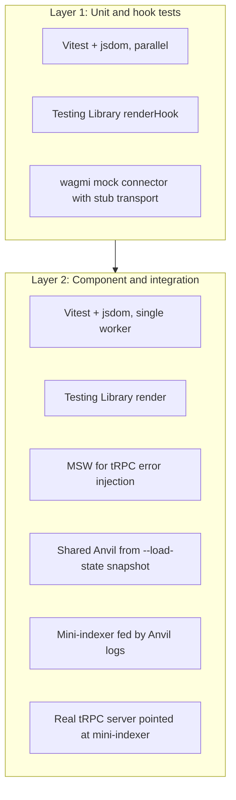

# Mock environment & component-level testing for the Subsquid Network app (wagmi v2 + viem)

> **Status:** plan, not yet executed.
> **Scope:** Anvil + TS deploy harness + log-driven mini-indexer + Vitest unit/integration.
> **Out of scope:** Playwright E2E — see [plans/playwright-e2e.md](playwright-e2e.md).

## 1. Review of the current branch (`cursor/mock-wallet-d5dd`)

The branch ships a manual local-dev mock stack but **no actual tests**. Concerns to address:

- [packages/server/src/services/mockRpcServer.ts](packages/server/src/services/mockRpcServer.ts) — 570 lines of hand-rolled `eth_call` selector dispatch. `handleMulticall3` admits it returns approximate (zero-padded) results, and unknown selectors silently return `0x`. Cannot validate write-path correctness.
- [packages/server/src/services/mockGraphqlServer.ts](packages/server/src/services/mockGraphqlServer.ts) — 625 lines of inline fixtures, decoupled from on-chain state (drift risk). Implements an **operation-name dispatcher** (reads `operationName`, returns hand-built fixtures), not a real GraphQL engine.
- [packages/client/src/config.ts](packages/client/src/config.ts) — `isMockMode` and `mockConfig` are computed at module load, so tests can't swap configs per scenario.
- [packages/client/src/App.tsx](packages/client/src/App.tsx) renders **alternative** `WagmiProvider` branches (only one mounted at runtime); account switching reloads the page (`window.location.reload()` in [MockConnectDialog.tsx](packages/client/src/components/MockConnectDialog.tsx)) — unusable from Vitest.
- Build-time coupling: [packages/client/vite.config.ts](packages/client/vite.config.ts) injects `MOCK_WALLET` and `MOCK_RPC_URL` as `process.env` defines.
- `isMockMode` is referenced in [config.ts](packages/client/src/config.ts) and [ConnectButton.tsx](packages/client/src/components/Button/ConnectButton.tsx); other mock-mode-only UI (no `isMockMode` import, but coupled to mock state) lives in [MockWalletAutoConnect.tsx](packages/client/src/components/MockWalletAutoConnect.tsx) and [LogoutMenuItem.tsx](packages/client/src/layouts/NetworkLayout/LogoutMenuItem.tsx).
- `.env.example` currently has `MOCK_WALLET=true` (and is the only diff vs `develop` on this branch). The example file should default to empty/false; treating `=true` as the example default would mean every fresh checkout starts in mock mode.

## 2. Target architecture



Two test layers in this plan, **increasing fidelity, increasing cost** (not a strict dependency order):

- **Layer 1 — unit / hook (fastest, most numerous).** Pure functions and custom hooks. Wagmi hooks tested with `renderHook` wrapped in `WagmiProvider({ config: mockOnly })`. Transport is a viem `custom` transport returning canned responses; **no Anvil, no network**.
- **Layer 2 — component / integration.** Render pages with React Router + `WagmiProvider(mockConfig)` + `QueryClientProvider`. Happy-path data flows through the real tRPC server → mini-indexer → shared Anvil instance. MSW only forces tRPC error/edge-case responses. Runs with `maxWorkers: 1` to share one Anvil cleanly.

## 3. Tooling decisions

- **Test runner:** Vitest (Vite-native, ESM-friendly, replaces stale `@types/jest`).
- **DOM:** `jsdom`, `@testing-library/react`, `@testing-library/user-event`, `@testing-library/jest-dom`.
- **GraphQL data:** new `packages/mock-stack/` workspace package — log-driven mini-indexer that **keeps the existing operation-name dispatcher contract** of `mockGraphqlServer.ts`. State is derived from Anvil event logs (real entities) plus synthetic aggregates (timeseries, summaries) for fields the real squid computes via aggregation. **No graphql-yoga, no SDL, no OpenCRUD filters** — those are explicitly deferred until/unless the real squid is run against Anvil.
- **tRPC error injection:** MSW v2 (`setupServer`) only for forcing tRPC error/edge-case responses.
- **EVM:** Foundry's **Anvil**, fresh chain with chain id `42161` / `421614`. Test client via `viem/test`'s `createTestClient` for `setBalance`, `mine`, `setStorageAt`, snapshot/revert.
- **Contract sources & deploy:** TS deploy harness using viem + forge build artifacts (no `forge script`, no upstream PR). Detailed in §4.
- **Wallet in tests:** wagmi `mock` connector (`wagmi/connectors`).
- **CI:** `foundry-rs/foundry-toolchain` for `forge build`.

## 4. The mock stack (replaces both mockRpcServer and mockGraphqlServer)

A single new workspace package: `packages/mock-stack/`. Used by Vitest globalSetup **and** `pnpm dev` mock mode — one code path. Optionally consumed by the Playwright plan via the same exported entrypoint; the package is complete and useful for Vitest + dev without executing the E2E plan.

### 4.0 Public entrypoint (single owner)

`packages/mock-stack/src/index.ts` exports one function used by every consumer:

```ts
export interface MockStackHandle {
  rpcUrl: string;
  graphqlUrl: string;
  deployments: AddressMap;
  testClient: TestClient;
  indexer: { resetAndReplay(): Promise<void>; waitUntilCaughtUp(): Promise<void>; lastBlock: number };
  stop(): Promise<void>;
}

export async function startMockStack(opts?: { stateFile?: string }): Promise<MockStackHandle>;
```

Vitest globalSetup, Playwright globalSetup, and `pnpm dev` mock mode all import this. No mock-stack lifecycle code lives in `packages/client/src/test/anvil/` — that directory only adapts the handle into Vitest's `globalSetup` shape and the per-test snapshot recipe.

### 4.1 Contract submodules and local mock contracts

- `sqd-portal-contracts/` — already a submodule. **Not modified** (no upstream PR).
- `sqd-network-contracts/` — to be added as a second submodule pointing at `github.com/subsquid/subsquid-network-contracts`.
- `packages/mock-stack/contracts/` — minimal Solidity in **this repo** (own `foundry.toml`):
  - `MockSQD.sol`, `MockUSDC.sol`, `MockWETH.sol` — straight ERC-20 mocks with mint
  - `MockV3Router.sol` — stubs only the Pancake/Uniswap V3 router functions that `DeployPortalSystem` calls (deterministic returns; no real swap math)
  - `Multicall3.sol` — canonical Multicall3 (deploy address irrelevant — wagmi config will point at whatever address we deploy at)

### 4.2 TS deploy harness (`packages/mock-stack/src/deploy.ts`)

Pure TypeScript using viem `walletClient.deployContract`. Reads compiled artifacts from each submodule's `out/<Contract>.sol/<Contract>.json` (each contains `abi` + `bytecode.object`). Steps:

1. Deploy `MockSQD`, `MockUSDC`, `MockWETH`, `MockV3Router`, `Multicall3`.
2. Deploy network contracts from `sqd-network-contracts/out/...` artifacts in dependency order (collecting addresses in JS variables — no hardcoding, no `vm.etch`).
3. Deploy portal contracts from `sqd-portal-contracts/out/...` artifacts, passing network-side addresses (workerPool, SQD, etc.) as constructor args / setter calls.
4. **Skip** the eager `factory.createPortalPool(...)` step from `DeployPortalSystem`. Tests create pools on demand via `harness.createPortalPool(...)`.
5. Seed persona state (ETH/SQD balances, sample worker registration, sample delegation) per `MOCK_FIXTURE_ACCOUNTS`.
6. Write deployed addresses to `packages/mock-stack/.deployments.json`.
7. Save chain state via `anvil_dumpState` to `packages/mock-stack/.anvil-state.json`.

### 4.3 Custom wagmi chain for Multicall3

Multicall3 is at a deterministic-but-not-canonical address on our chain. The wagmi `Chain` config used in mock mode overrides `contracts.multicall3.address` from `.deployments.json`. Done in [packages/client/src/config.ts](packages/client/src/config.ts).

### 4.4 Mini-indexer (`packages/mock-stack/src/indexer/`)

- viem `getLogs` against Anvil for events from network + portal contracts.
- Mappings ported from `squid-subsquid-network` (URL pinned in `PORT_VERSION` file).
- In-memory entity store (TS Maps) with deterministic iteration.
- **HTTP server keeps the operation-name dispatcher contract** — accepts `{ operationName, variables }`, returns canned-shape JSON matching `mockGraphqlServer.ts` today. The 41 named operations in `packages/server/graphql/*.graphql` are the surface to fill.
- Two-tier responses:
  - **Chain-derived entities** (workers, delegations, bonds, claims, vesting unlocks, portal pool deposits) computed from logs.
  - **Synthetic aggregates** (timeseries, summaries, APR rolls, epoch counters, settings) reuse the existing `numericSeries` / `objectSeries` style from `mockGraphqlServer.ts`. **Math.random forbidden in replay paths**; use deterministic PRNG seeded by block timestamp.
- Reset = clear store + replay from genesis logs (cheap because chain history is short).

## 5. Required client/server refactors

- **`packages/client/src/config.ts`:** export `createAppWagmiConfig({ mode, rpcUrl, multicall3Address, accounts })`. Module-level constants removed; computed once in [App.tsx](packages/client/src/App.tsx) from env.
- **`packages/client/src/App.tsx`:** collapse the two branches into one provider tree taking a `config` prop.
- **Account switching refactor (investigation, not assumed):** verify whether wagmi v2's `useSwitchAccount` works against the `mock` connector with multiple accounts. If yes, drop `sessionStorage` + reload. If no, keep current reload-based flow but isolate it from test code paths. **E2E persona selection does not depend on this** — it uses a Playwright-only `__mockAccount` hook (see [playwright-e2e.md](playwright-e2e.md) §4).
- **`packages/common/src/addresses.ts`:** add `getContractAddresses({ override?: AddressMap })` reading from `.deployments.json` in mock mode.
- **`packages/server/src/env.ts`:** `getWorkersSquidUrl` / `getGatewaysSquidUrl` / `getTokenSquidUrl` already collapse to one mock URL when `isMockGraphql()` is true — keep this. The mini-indexer is a single endpoint serving all three squids' operations (operation names don't collide). **Note:** there is no separate `POOL_SQUID_API_URL` in this codebase — pool data flows through the gateways squid.

## 6. Anvil + cache strategy

The harness deploys are not free (`forge build` cost dominated by `via_ir = true`, ~tens of seconds cold). Run deploys **once per CI job**, not per worker:

```
turbo task: mock-stack#prepare
  1. forge build in each contracts submodule (cache out/ keyed on submodule SHA)
  2. anvil --chain-id 42161 (background)
  3. ts-node packages/mock-stack/src/deploy.ts  (writes .deployments.json + .anvil-state.json)
  4. kill anvil

turbo task: client#test  (depends on mock-stack#prepare)
  Vitest globalSetup:
    - anvil --chain-id 42161 --load-state .anvil-state.json
    - start mini-indexer (replays logs from genesis)
    - start tRPC server pointing at mini-indexer
  beforeEach:
    - testClient.revert(baseSnapshot)
    - queryClient.clear()                  # reset wagmi/React Query cache
    - await indexer.resetAndReplay()
    - await indexer.waitUntilCaughtUp()    # barrier before tests assert
    - baseSnapshot = await testClient.snapshot()
```

**Worker isolation:** the integration Vitest project runs with `pool: 'forks'` and `poolOptions.forks.singleFork: true` (effectively `maxWorkers: 1`) to avoid Anvil port collisions. Layer 1 (unit/hook) runs with full parallelism since it has no Anvil.

## 7. Directory layout to add

```
packages/mock-stack/
  foundry.toml
  contracts/
    MockSQD.sol
    MockUSDC.sol
    MockWETH.sol
    MockV3Router.sol
    Multicall3.sol
  src/
    deploy.ts              # TS harness
    seed.ts                # persona seeding
    chain.ts               # spawn/kill anvil + state load
    indexer/
      mappings/            # ported from squid-subsquid-network
      entities/
      synthetic.ts         # timeseries/aggregates with deterministic PRNG
      dispatcher.ts        # operationName -> resolver lookup
      server.ts            # HTTP server replicating mockGraphqlServer.ts contract
    deployments.ts         # read/write .deployments.json
  PORT_VERSION             # pinned upstream squid commit

packages/client/
  src/
    test/
      setup.ts             # vitest globals, jest-dom, msw setupServer
      msw/
        trpc-error-handlers.ts
        server.ts
      wagmi/
        testConfig.ts      # createAppWagmiConfig + custom multicall3
      anvil/
        global-setup.ts    # spawn anvil, indexer, tRPC server
        snapshot.ts        # revert + queryClient.clear + indexer reset
      render.tsx
  vitest.config.ts         # 'unit' and 'integration' projects

packages/server/
  src/**/__tests__/*.test.ts
  vitest.config.ts
```

## 8. CI integration

- Add `test` and `mock-stack#prepare` to root `turbo.json`. Cache `coverage/**`, `packages/mock-stack/.anvil-state.json`, submodule `out/**`.
- `.github/workflows/test.yaml`:
  - `actions/checkout@v4` with `submodules: recursive`.
  - `foundry-rs/foundry-toolchain@v1`.
  - `forge build` per submodule + this repo's mock contracts (cached).
  - Run `mock-stack#prepare` (artifact: `.anvil-state.json`).
  - `pnpm test` (Vitest reuses the prepared state).
- Update [AGENTS.md](../AGENTS.md) §"Testing & Quality Gates".

## 9. Risks & mitigations

- **Mock router insufficient for some flow:** add per-flow stubs as needed; PortalPool deposits without real swap math may need fixed-rate stub responses.
- **Submodule artifact staleness:** turbo task `mock-stack#prepare` depends on submodule SHA; CI rebuilds when SHA changes; locally `pnpm mock-stack:rebuild`.
- **Schema/operation drift:** the named-operation surface lives in `packages/server/graphql/*.graphql` (~41 ops). A pre-test check enumerates expected operations and fails if the dispatcher is missing one.
- **Mini-indexer mapping drift vs real squid:** pin commit in `PORT_VERSION`; backlog item to re-port on upstream change. Long-term: run real squid against Anvil.
- **Anvil flakiness on Windows / WSL:** Layer 1 stays runnable without Anvil/Foundry so contributors can iterate offline.
- **Existing branch is mid-flight:** stage refactors so dev-mode mock workflow keeps working at every step. Don't delete `mockRpcServer.ts` / `mockGraphqlServer.ts` until the new `mock-stack` dev path is in place.

## 10. Open items deliberately deferred

- **Playwright E2E** — see [plans/playwright-e2e.md](playwright-e2e.md). Builds on top of the mock stack delivered here.
- Real wallet UX E2E (RainbowKit modal, MetaMask sign rejection, chain switch prompt) — requires Synpress, deferred to the E2E plan.
- Real squid against Anvil (drop-in replacement for mini-indexer) — long-term option.
- L2-specific behaviors (`gasPrice`, fee tokens) — fresh Anvil with chain id 42161 doesn't replicate Arbitrum L2 semantics; if a flow needs L2-specific gas, it requires a forked Arbitrum profile.

## 11. Implementation todos (order)

1. **scaffold-vitest** — Vitest config in client + server; jsdom, RTL, jest-dom; replace `@types/jest`. Add `unit` + `integration` Vitest projects.
2. **refactor-config** — `createAppWagmiConfig` factory; collapse `App.tsx`; investigate `useSwitchAccount` viability.
3. **mock-stack-package** — Create `packages/mock-stack/` with `foundry.toml`, mock contracts (SQD/USDC/WETH/Router/Multicall3).
4. **contract-submodules** — Add `sqd-network-contracts` submodule; verify `forge build` per submodule produces `out/`.
5. **deploy-harness** — TS deploy + seed; produce `.deployments.json` + `.anvil-state.json`.
6. **addresses-override** — `getContractAddresses({ override })` reading `.deployments.json` in mock mode.
7. **mini-indexer** — log → entity store + synthetic aggregates; HTTP server with operation-name dispatcher (replaces `mockGraphqlServer.ts` shape-for-shape).
8. **msw-trpc-errors** — MSW v2 wired only for tRPC error injection.
9. **first-tests** — One hook test (no Anvil), one component test (Anvil + mini-indexer), one Anvil-backed write test.
10. **drop-old-mocks** — delete `mockRpcServer.ts`, `mockGraphqlServer.ts`, page-reload account switch (only if step 2 confirmed `useSwitchAccount` works).
11. **ci-and-docs** — turbo tasks + GitHub Actions workflow; update `AGENTS.md` and `README.md`.
